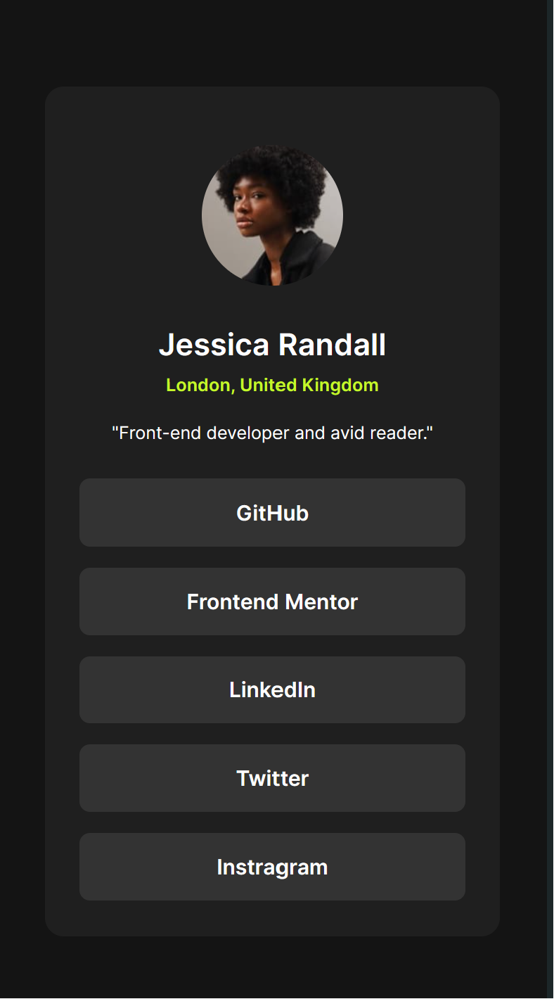

# Frontend Mentor - Social links profile solution

This is a solution to the [Social links profile challenge on Frontend Mentor](https://www.frontendmentor.io/challenges/social-links-profile-UG32l9m6dQ). Frontend Mentor challenges help you improve your coding skills by building realistic projects. 

## Table of contents

- [Overview](#overview)
  - [The challenge](#the-challenge)
  - [Screenshot](#screenshot)
  - [Links](#links)
- [My process](#my-process)
  - [Built with](#built-with)
  - [What I learned](#what-i-learned)
  - [Continued development](#continued-development)
  - [Useful resources](#useful-resources)
- [Author](#author)
- [Acknowledgments](#acknowledgments)

## Overview

### The challenge

Users should be able to:

- See hover and focus states for all interactive elements on the page

### Screenshot

 - Active View
 - Desktop View
 - Mobile View

### Links

- Solution URL: [Solution](https://github.com/0653Jerico/Social-Links-Profile-Challenge)
- Live Site URL: [Social Links Profile Live](https://0653jerico.github.io/Social-Links-Profile-Challenge/)

## My process

### Built with

- Semantic HTML5 markup
- CSS custom properties
- Flexbox

### What I learned

I learned a lot during this retake on the challenge and took me some time to get the design that somehow copies the original using new properties learned. I understood a little bit the use of clamp() in CSS.

### Continued development

I will continue using the most common used properties and the advanced properties soon as I go up higher.

### Useful resources

- [Google Fonts](https://www.fonts.google.com) - Still using this website to get my fonts, it is easy and contains a lot of fonts.
- [W3schools](https://www.w3schools.com) - I still rely on this website since it provides simplified explanations with examples.
- [Stack Overflow](https://www.stackoverflow.com) - Search over the internet for some solutions to my problems and found it here, it was a big help.
-[ChatGpt](https:/chat.openai.com) - I used the AI chat to help assisst me in understanding the concepts that I am having difficulty understanding.

## Author

- Frontend Mentor - [@0653Jerico](https://www.frontendmentor.io/profile/0653Jerico)
- Github - [@0653Jerico](https://www.github.com/0653Jerico)

## Acknowledgments

Big thanks to @danielmrz-dev, @DarkstarXDD and @DylandeBrujin for commenting useful information in my last challenge which helped me with this challenge. Big thanks also to Frontend Mentor for providing such a wonderful website where people can learn and be taught for free. 
