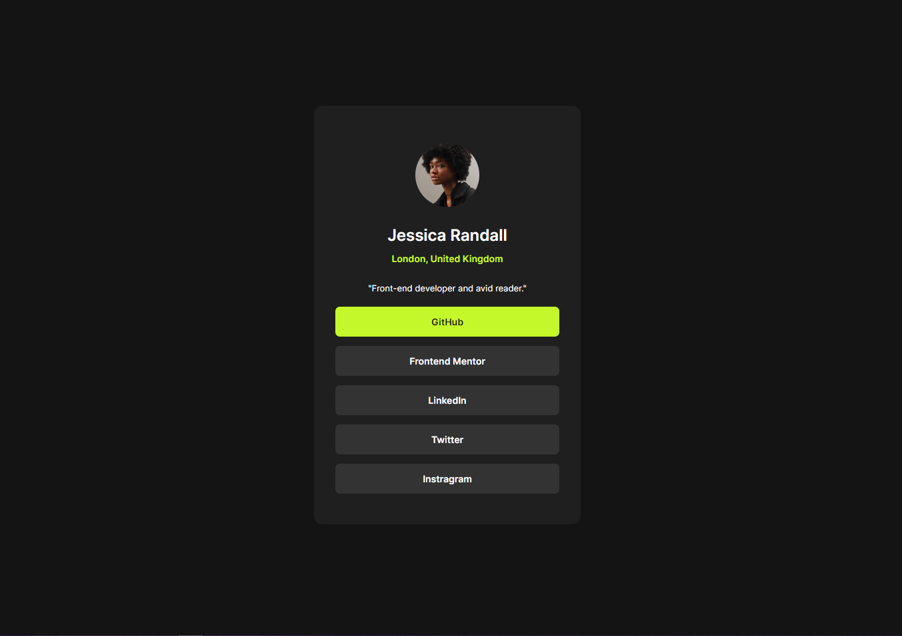

# Frontend Mentor - Social links profile solution

This is a solution to the [Social links profile challenge on Frontend Mentor](https://www.frontendmentor.io/challenges/social-links-profile-UG32l9m6dQ). Frontend Mentor challenges help you improve your coding skills by building realistic projects. 

## Table of contents

- [Overview](#overview)
  - [The challenge](#the-challenge)
  - [Screenshot](#screenshot)
  - [Links](#links)
- [My process](#my-process)
  - [Built with](#built-with)
  - [What I learned](#what-i-learned)
  - [Continued development](#continued-development)
  - [Useful resources](#useful-resources)
- [Author](#author)
- [Acknowledgments](#acknowledgments)

## Overview

### The challenge

Users should be able to:

- See hover and focus states for all interactive elements on the page

### Screenshot

 - Active View
 - Desktop View
 - Mobile View

### Links

- Solution URL: [Solution](https://github.com/0653Jerico/Social-Links-Profile-Challenge)
- Live Site URL: [Social Links Profile Live](https://0653jerico.github.io/Social-Links-Profile-Challenge/)

## My process

### Built with

- Semantic HTML5 markup
- CSS custom properties
- Flexbox

### What I learned

I learned a lot during this challenge and took me some time to complete it. I learned how to use CSS variables as well as understand a little bit the width, min and max width of the body. 

### Continued development

Use this section to outline areas that you want to continue focusing on in future projects. These could be concepts you're still not completely comfortable with or techniques you found useful that you want to refine and perfect.

### Useful resources

- [Google Fonts](https://www.fonts.google.com) - Still using this website to get my fonts, it is easy and contains a lot of fonts.
- [W3schools](https://www.w3schools.com) - I still rely on this website since it provides simplified explanations with examples.
- [Stack Overflow](https://www.stackoverflow.com) - Search over the internet for some solutions to my problems and found it here, it was a big help.

## Author

- Frontend Mentor - [@0653Jerico](https://www.frontendmentor.io/profile/0653Jerico)
- Github - [@0653Jerico](https://www.github.com/0653Jerico)

## Acknowledgments

Big thanks to @danielmrz-dev and @DylandeBrujin for commenting useful information in my last challenge which helped me with this challenge. Big thanks also to Frontend Mentor for providing such a wonderful website where people can learn and be taught for free. 
